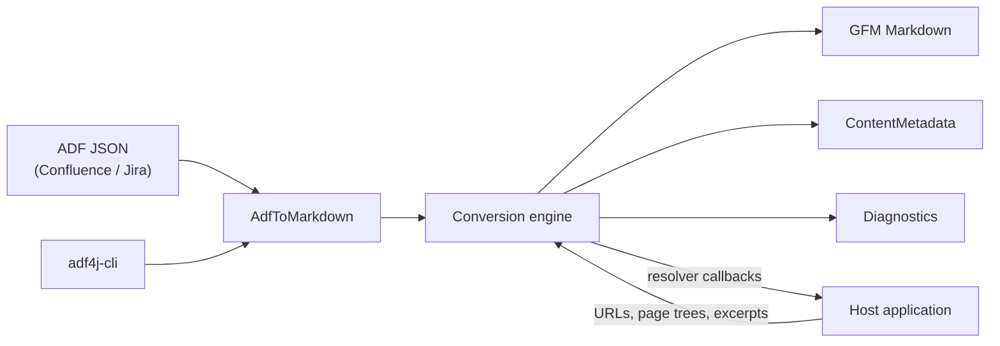
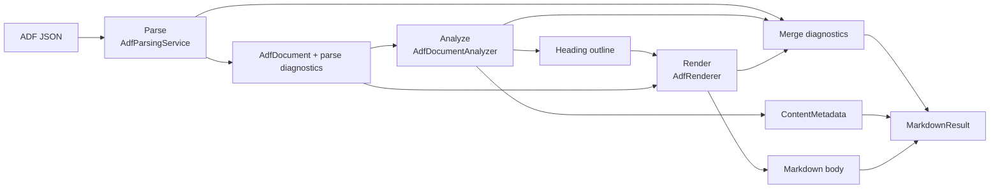
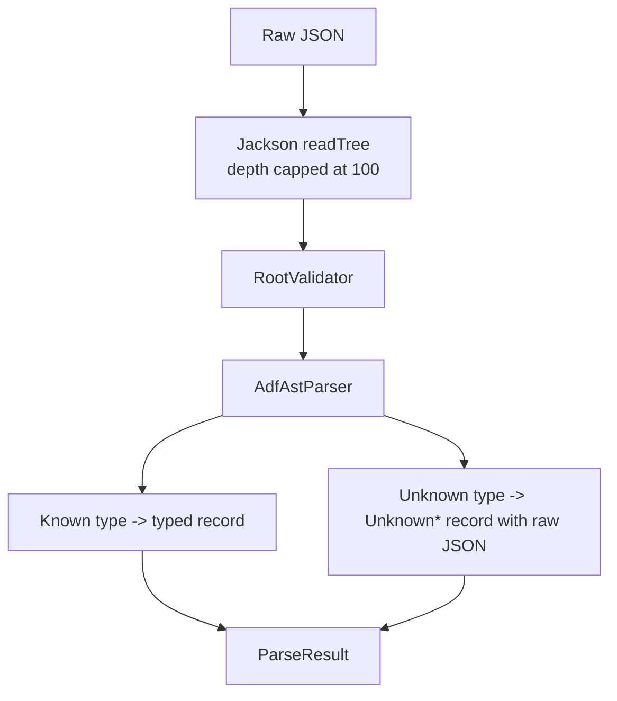

# Architecture

This document describes adf4j internals for contributors and advanced integrators. For first use, see [Getting started](./getting-started.md). For integration recipes, see the [Guide](./guide.md). For option, mapping, diagnostic, and CLI tables, see the [Reference](./reference.md).

## Design goals

1. **Correct GFM output:** Prefer valid GitHub-Flavored Markdown. Use HTML, placeholders, or diagnostics when GFM cannot express the ADF construct.
2. **Visible loss:** Record diagnostics when content is changed, dropped, or cannot be parsed.
3. **Safe defaults:** Treat ADF as untrusted input. Bound parser depth, sanitize URL schemes, and isolate callback failures.
4. **Small public API:** Export a focused JPMS surface and keep implementation packages internal.
5. **Reusable lifecycle:** Build one immutable converter and pass per-call options for page-specific state.

## System context

adf4j is an embeddable transformation library. It accepts an ADF JSON string or parsed `AdfDocument`, then returns Markdown plus metadata and diagnostics. It does not perform network, filesystem, or database I/O.

The host application owns Confluence access, CDN URLs, page hierarchy, and macro-specific data. adf4j owns parsing, analysis, Markdown rendering, escaping, and diagnostics.

## Module and package structure

| Artifact                | Module       | Role                                                     |
| ----------------------- | ------------ | -------------------------------------------------------- |
| `dev.nthings:adf4j`     | `adf4j-lib`  | JPMS library module `dev.nthings.adf4j`.                 |
| `dev.nthings:adf4j-cli` | `adf4j-cli`  | Command-line wrapper over the library.                   |
| `adf4j-wasm`            | `adf4j-wasm` | Optional WebAssembly packaging under the `wasm` profile. |

Exported packages:

| Package                        | Contains                                                  |
| ------------------------------ | --------------------------------------------------------- |
| `dev.nthings.adf4j`            | `AdfToMarkdown`.                                          |
| `dev.nthings.adf4j.ast`        | Public AST records.                                       |
| `dev.nthings.adf4j.options`    | `MarkdownOptions`, resolver hooks, renderer hooks, enums. |
| `dev.nthings.adf4j.result`     | `MarkdownResult`, `ParseResult`, `Diagnostic`.            |
| `dev.nthings.adf4j.metadata`   | `ContentMetadata` and reference records.                  |
| `dev.nthings.adf4j.confluence` | `ConfluenceRenderContext` and `ConfluenceMetadata`.       |

Everything under `internal.*` is implementation detail. JPMS enforces that boundary. Integrators should use `AdfToMarkdown` plus the public option, result, metadata, Confluence, and AST types.

## The conversion pipeline

`AdfPipeline` owns one parser, analyzer, and renderer. It is assembled once and is stateless after construction.

Phases:

| Phase   | Component             | Output                                                     |
| ------- | --------------------- | ---------------------------------------------------------- |
| Parse   | `AdfParsingService`   | `AdfDocument` plus parse diagnostics.                      |
| Analyze | `AdfDocumentAnalyzer` | Heading outline, `ContentMetadata`, lossiness diagnostics. |
| Render  | `AdfRenderer`         | Markdown body, unresolved references, macro diagnostics.   |

Analysis precedes rendering because rendering can depend on global document facts. A table-of-contents macro needs all headings, and heading anchors must be unique before the first rendered line.

Public methods expose the pipeline at different depths:

- `parse()` runs parse only.
- `analyze()` runs parse and analyze.
- `convert()` and `toMarkdown()` run all three phases.

`convert(ParseResult, options)` lets callers parse once and render many times while preserving parse diagnostics in every render result.

## Phase 1: Parsing

The parser uses Jackson in tree mode and a hand-written recursive descent parser. It validates the document envelope before building the AST.

Robustness checks:

- Blank or invalid JSON yields an empty parse result with diagnostics.
- Nesting is capped at depth 100.
- Root validation reports missing document, invalid root type, invalid root node, invalid version, invalid content, and unsupported version.
- Unsupported version is a warning; parsing continues best effort.

### AST type model

The AST is a sealed hierarchy of immutable records:

- `AdfNode` permits `AdfDocument`, `AdfBlock`, and `AdfInline`.
- `AdfBlock` covers paragraphs, headings, lists, tables, media, cards, layout, extensions, and `UnknownBlock`.
- `AdfInline` covers text-adjacent inline constructs and `UnknownInline`.
- `AdfMark` is a separate hierarchy for marks that decorate text and media, including `UnknownMark`.

Records defensively copy collections and normalize missing values to safe defaults. `Attributes` and `MacroParams` preserve product-specific data without tying the AST to a single Atlassian schema.

### Unknown node handling

Unknown block and inline nodes are preserved as raw JSON in `Unknown*` records. Rendering behavior is deferred to `UnknownNodePolicy`. Unknown marks have no standalone rendering form, so they are always dropped with a warning.

## Phase 2: Analysis

Analysis extracts information known before rendering:

- Heading outline and unique anchors.
- References to pages, external links, mentions, media, attachments, page-tree macros, and excerpt includes.
- Excerpt definitions.
- Unknown-node and unknown-mark diagnostics.

`AdfDocumentAnalyzer` performs one pre-order walk with independent visitors:

| Visitor                       | Purpose                                                         |
| ----------------------------- | --------------------------------------------------------------- |
| `AdfHeadingCollector`         | Builds heading text, anchors, and TOC level ranges.             |
| `AdfContentMetadataExtractor` | Builds `ContentMetadata` in document order.                     |
| `AdfLossinessCollector`       | Converts unknown-node and unknown-mark counts into diagnostics. |

`ContentMetadata` is a public deliverable. It lets callers build link graphs, search indexes, navigation sidebars, and fetch plans without rendering.

### Confluence layer

Confluence-specific knowledge is isolated:

- `ConfluenceRenderContext` stores the caller-supplied attachment inventory and resolves attachment titles.
- `ConfluenceMetadata` exposes typed data from Confluence link metadata.
- `internal.ConfluenceSupport` contains Confluence heuristics such as page ID extraction, macro namespace checks, and anchor parsing.

The rest of the engine asks these helpers whether a node is a page reference, attachment macro, or known Confluence macro.

## Phase 3: Rendering

The renderer walks the AST with the precomputed heading outline and active `MarkdownOptions`.

Key state:

- `RenderContext` holds options, resolver hooks, heading outline, `MacroDiagnostics`, and `UnresolvedTracker`.
- `RendererState` is an immutable cursor for list depth, table-cell context, and heading context.

Focused renderers handle tables, lists, cards, macros, media, and marks. They recurse through `BlockRecursion` when nested content needs normal block or inline rendering.

### GFM fallback strategy

The renderer prefers native GFM and falls back only when needed:

- Complex tables use HTML.
- Visual marks drop by default or become inline HTML with `htmlVisualMarks`.
- Missing media and attachment URLs become inert placeholders.
- Unsupported macros become placeholders with diagnostics.
- Hard breaks adapt to heading, table-cell, or body context.

The complete behavior list is in [Lossy and by-design behaviours](./reference.md#lossy-and-by-design-behaviours).

### Text and URL safety

`MarkdownText` centralizes Markdown escaping, block-marker neutralization, and code fence sizing. `MarkdownInputCleaner` normalizes text before Markdown fragments are re-parsed for HTML table cells.

URL destinations are scheme-sanitized before output. `ExtensionRenderer` and `ExcerptResolver` are exceptions because their Markdown is inserted verbatim.

## Extensibility model

`MarkdownOptions` exposes functional hooks for caller-owned data:

| Hook                 | Caller supplies            |
| -------------------- | -------------------------- |
| `MediaResolver`      | Media URLs.                |
| `AttachmentResolver` | Attachment URLs.           |
| `PageLinkResolver`   | Page URLs.                 |
| `PageTreeResolver`   | Page hierarchy entries.    |
| `ExcerptResolver`    | Rendered excerpt Markdown. |
| `ExtensionRenderer`  | Custom extension Markdown. |

All hooks are guarded. Returning `null`, returning a blank URL, or throwing declines the lookup and falls back to default behavior. Non-null answers are authoritative.

## Error handling and diagnostics

adf4j reports most problems as data:

| Type             | Carries                                                 |
| ---------------- | ------------------------------------------------------- |
| `ParseResult`    | Parsed document, parse diagnostics, and `validAdfRoot`. |
| `MarkdownResult` | Body, metadata, diagnostics, and unresolved references. |
| `Diagnostic`     | Code, message, optional cause, and severity.            |

Severity meanings:

- `INFO`: non-lossy note.
- `WARNING`: content changed or dropped.
- `ERROR`: conversion failed or produced an empty body.

`MarkdownResult.wasLossy()` is true for `WARNING` or `ERROR`. Expected option-driven output is not counted as lossy. The only hard-failure rendering mode is `UnknownNodePolicy.FAIL`, which throws `IllegalStateException` for unknown nodes.

## Concurrency and lifecycle

`AdfToMarkdown` is immutable and thread-safe. `AdfPipeline`, parser, analyzer, and renderer are stateless after construction. Per-render mutable state is created fresh and never shared.

Recommended lifecycle:

1. Create one converter at startup with `AdfToMarkdown.create()` or `AdfToMarkdown.with(options)`.
2. Reuse it across documents and threads.
3. Pass per-call `MarkdownOptions` when resolver state changes by page.

## Dependencies and packaging

The library targets JDK 25 and uses:

| Dependency                     | Purpose                                                  |
| ------------------------------ | -------------------------------------------------------- |
| Jackson                        | JSON tree reading.                                       |
| CommonMark plus GFM extensions | Markdown parsing and HTML conversion for table fallback. |
| jsoup                          | HTML table construction and serialization.               |
| JSpecify                       | Nullness annotations.                                    |
| SLF4J                          | Logging, especially callback failures.                   |

`adf4j-cli` is a thin wrapper built on [aesh](https://aeshell.github.io/). Commands are annotated classes; the aesh annotation processor generates command metadata and field accessors at compile time (plus the matching `META-INF/native-image` configs), so command parsing stays reflection-free in the native image. Jackson runs in tree mode. Release artifacts are native executables plus the optional WASM build. The CLI jar is not a fat jar.

## Key design decisions

| Decision                                  | Rationale                                                | Trade-off                                                      |
| ----------------------------------------- | -------------------------------------------------------- | -------------------------------------------------------------- |
| Parse, analyze, render pipeline           | Rendering needs global heading and metadata facts.       | One extra tree traversal.                                      |
| Sealed AST records                        | Compile-time exhaustiveness and immutable data.          | Adding a node type touches exhaustive switches.                |
| Unknown nodes preserved                   | Forward compatibility with newer ADF.                    | Larger public AST surface.                                     |
| One analysis walk with visitors           | Metadata, outline, and lossiness share traversal cost.   | Visitors must stay independent.                                |
| Diagnostics as data                       | Callers can inspect quality without catching exceptions. | Callers must check `wasLossy()` or severity.                   |
| Guarded resolver callbacks                | I/O and environment state stay in the host application.  | Callers must implement resolvers for real URLs and page trees. |
| JPMS encapsulation                        | Stable public API over changeable internals.             | Internals are unavailable to integrations.                     |
| Immutable converter with per-call options | Thread-safe reuse.                                       | Option state must be passed explicitly.                        |
