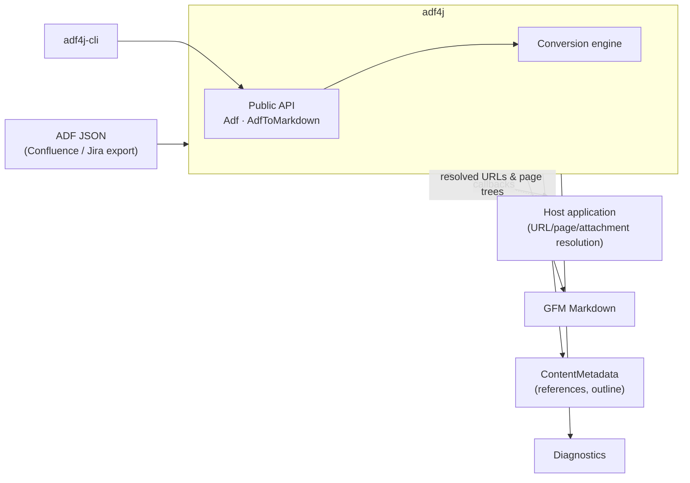
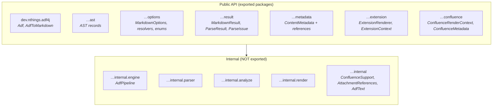
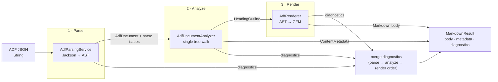
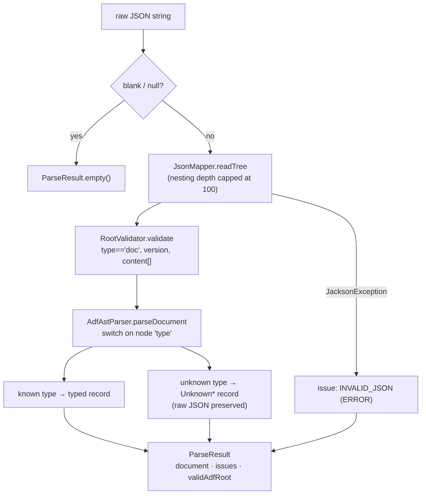
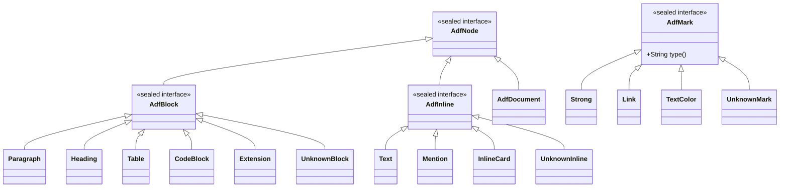
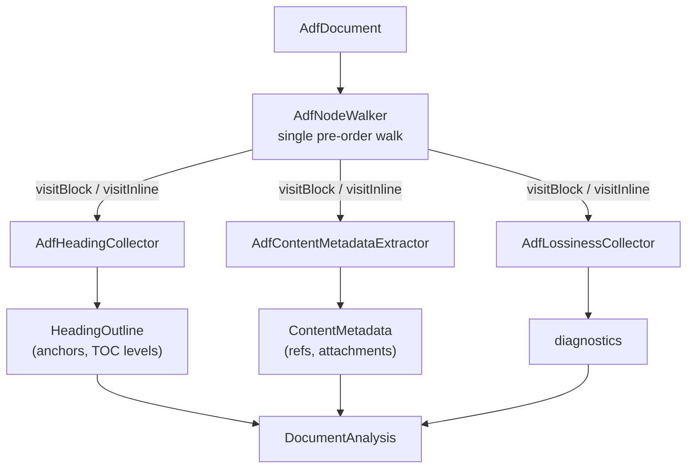
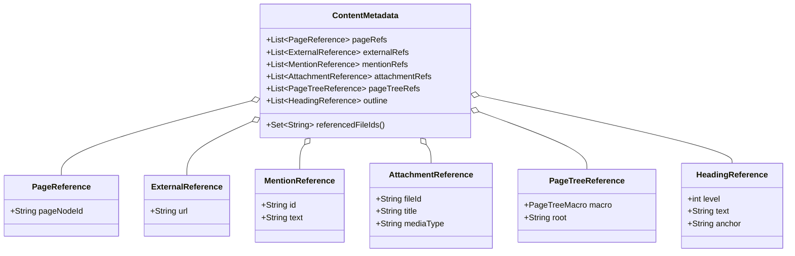
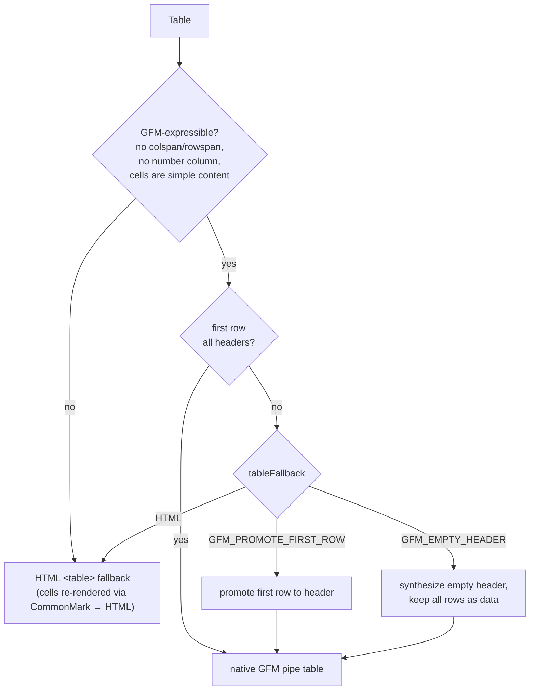
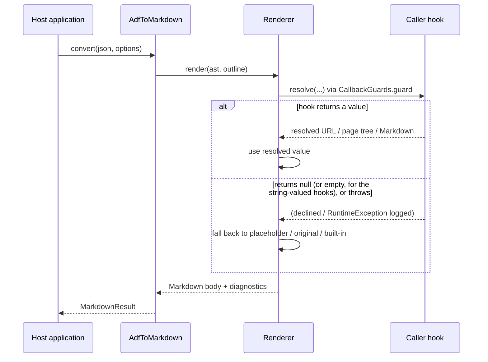

# adf4j — Architecture

`adf4j` is a Java library that converts **Atlassian Document Format (ADF)** JSON into **GitHub-Flavored Markdown (GFM)**. This document describes its internal design: the module layout, the conversion pipeline, the data model, and the extensibility and error-handling models that hold it together.

It is written for contributors and for integrators who need to reason about behaviour beyond the public surface. For task-oriented examples, see the [Usage Guide](./usage-guide.md); for the exhaustive list of conversion options and their lossy/by-design behaviours, see [Markdown Conversion](./markdown-conversion.md); for the ADF source format, see the [spec reference](./spec/README.md).

## Table of contents

- [Design goals](#design-goals)
- [System context](#system-context)
- [Module and package structure](#module-and-package-structure)
- [The conversion pipeline](#the-conversion-pipeline)
- [Phase 1 — Parsing](#phase-1--parsing)
- [Phase 2 — Analysis](#phase-2--analysis)
- [Phase 3 — Rendering](#phase-3--rendering)
- [Extensibility model](#extensibility-model)
- [Error handling and diagnostics](#error-handling-and-diagnostics)
- [Concurrency and lifecycle](#concurrency-and-lifecycle)
- [Dependencies and packaging](#dependencies-and-packaging)
- [Key design decisions](#key-design-decisions)

## Design goals

The architecture is shaped by five priorities, in roughly this order:

1. **Correctness and fidelity to GFM.** The output target is plain GitHub-Flavored Markdown. Constructs that GFM cannot express degrade predictably (HTML fallback, placeholders, or dropped marks) rather than producing malformed Markdown.
2. **Lossless awareness.** Where information *is* lost, the conversion records a diagnostic. Callers can detect this programmatically and never have to diff input against output to discover a problem.
3. **Safety against untrusted input.** ADF is treated as adversarial: parsing is bounded against resource-exhaustion, URL destinations are scheme-sanitized, and caller callbacks are sandboxed so a single failure cannot abort a conversion.
4. **Encapsulation.** A small, deliberately curated public API sits on top of a large internal implementation. The boundary is enforced by the Java Platform Module System (JPMS), not by convention.
5. **Reuse and thread-safety.** A converter is built once and reused across documents and threads. Per-document variation is expressed through immutable options, never by rebuilding the engine.

## System context

`adf4j` is an embeddable, dependency-light transformation library. It performs no I/O of its own — it accepts an ADF JSON string (or a pre-parsed document) and returns Markdown plus metadata. Any network access (fetching the binary behind a media node, resolving a page hierarchy) is delegated back to the caller through resolver callbacks.

The library never reaches out to Confluence, a CDN, or a database. That isolation keeps it deterministic and testable, and pushes all environment-specific concerns (authentication, base URLs, page hierarchy) into well-defined extension points.

## Module and package structure

The project is a Maven multi-module build with two artifacts under the `dev.nthings` group:

| Artifact | Module | Role |
| --- | --- | --- |
| `dev.nthings:adf4j` | `adf4j-lib` | The library (a JPMS module, `dev.nthings.adf4j`). |
| `dev.nthings:adf4j-cli` | `adf4j-cli` | A thin command-line wrapper over the library. |

The library’s public API is defined by its `module-info.java`: seven exported packages, everything else encapsulated.

The significance of this split is contractual: **only the exported packages are API.** The `internal.*` packages — the parser, the analyzer, the renderer, and the pipeline that wires them — can change freely between releases. Integrators interact with the engine exclusively through `AdfToMarkdown`/`Adf` and the option, result, and metadata types.

Within the public surface, `MarkdownOptions` is the canonical record but is constructed through `defaults()` + `withX(...)` withers or a `builder()` — never the raw constructor, whose parameter list grows as options are added. This keeps the public configuration API forward-compatible.

## The conversion pipeline

Internally, every conversion flows through `AdfPipeline` (in `internal.engine`), the composition root that owns one instance each of the parser, analyzer, and renderer. It is assembled once via `AdfPipeline.createDefault()` and is stateless thereafter. The pipeline runs three sequential phases:

The three phases have distinct responsibilities and distinct outputs:

| Phase | Component | Input | Output |
| --- | --- | --- | --- |
| Parse | `AdfParsingService` | JSON string | `AdfDocument` AST + parse issues |
| Analyze | `AdfDocumentAnalyzer` | `AdfDocument` | Heading outline, `ContentMetadata`, lossiness diagnostics |
| Render | `AdfRenderer` | `AdfDocument` + outline | Markdown body + macro diagnostics |

A key structural decision is that **analysis precedes rendering and feeds it.** The renderer needs the document’s full heading outline before it emits the first line — a Table-of-Contents macro near the top of a document refers to headings further down, and heading anchors must be globally unique. Running a complete analysis pass first means the renderer is a pure forward walk with no need to look ahead or backpatch.

`AdfToMarkdown` exposes the pipeline phases selectively. `parse()` runs phase 1 only; `analyze()` runs phases 1–2 (no rendering); `convert()`/`toMarkdown()` run all three. `analyze()` and `convert()` accept either a JSON string or a pre-parsed input (so a document can be analyzed and rendered repeatedly without re-parsing): `convert()` takes the `ParseResult` itself — carrying its parse issues into each render — or a bare `AdfDocument`, and `analyze()` takes an `AdfDocument`; `parse()` and `toMarkdown()` take the JSON string. The `convert`, `analyze`, and `toMarkdown` forms each accept per-call `MarkdownOptions` to override the converter’s bound options without rebuilding anything.

The three phases’ diagnostics are concatenated in pipeline order — parse issues first, then analyze-phase lossiness, then render-phase macro warnings — into the single `MarkdownResult.diagnostics()` list.

## Phase 1 — Parsing

The parser turns a raw JSON string into a typed, immutable AST. It uses Jackson (`tools.jackson`, v3) purely as a tree reader: `JsonMapper.readTree(...)` produces a `JsonNode`, and a hand-written recursive descent (`AdfAstParser`) maps that tree onto the AST records by switching on each node’s `"type"` field.

### The AST type model

The AST is a closed algebraic data type built from **sealed interfaces** and **records**. Sealing gives the compiler an exhaustiveness guarantee: every `switch` over a node category must handle every permitted type, so adding a node type surfaces as a compile error at each site that must change.

The four roots organize roughly sixty concrete types:

- **`AdfNode`** is the top of the structural tree and permits exactly `AdfDocument`, `AdfBlock`, and `AdfInline`.
- **`AdfBlock`** permits the 34 block-level constructs: structural (`Paragraph`, `Heading`, `Blockquote`, `Rule`), lists (`BulletList`, `OrderedList`, `ListItem`, `TaskList`/`TaskItem`, `DecisionList`/`DecisionItem`), tables (`Table`, `TableRow`, `TableCell`), media and layout (`MediaSingle`, `MediaGroup`, `Media`, `LayoutSection`, `LayoutColumn`, `Expand`), cards (`BlockCard`, `EmbedCard`), and extensions (`Extension`, `BodiedExtension`, `MultiBodiedExtension`), plus `UnknownBlock`.
- **`AdfInline`** permits the 11 inline constructs: `Text`, `HardBreak`, `Mention`, `Emoji`, `Date`, `Status`, `Placeholder`, `InlineCard`, `MediaInline`, `InlineExtension`, plus `UnknownInline`.
- **`AdfMark`** is a *separate* hierarchy (marks decorate text and media, they are not nodes). It permits the 18 formatting marks: `Strong`, `Em`, `Code`, `Strike`, `Underline`, `Link`, the visual-only marks (`TextColor`, `BackgroundColor`, `Border`, `FontSize`, `Alignment`, `Indentation`), and others, plus `UnknownMark`.

Every AST type is an immutable `record`. Collection components are defensively copied in compact constructors (`List.copyOf`, `Map.copyOf`), and missing fields normalize to safe defaults (empty collections, empty strings) rather than nulls. Product-specific attributes that the AST does not model explicitly are preserved generically: `Attributes` wraps a `Map<String, Object>` and `MacroParams` wraps a `Map<String, String>`, decoupling the AST from both the JSON library and any single product’s schema. This is how, for example, the Confluence layer later reads `__confluenceMetadata` off a link without the core AST depending on Confluence.

### Unknown node handling

Forward-compatibility is built into the type model. Any `type` the parser does not recognize becomes an `UnknownBlock`, `UnknownInline`, or `UnknownMark` that carries the node’s **re-serialized raw JSON**. Nothing is silently discarded at parse time — the decision of what to *do* with an unknown node (placeholder, skip, preserve, or fail) is deferred to the render phase and governed by `UnknownNodePolicy`. This is what lets the library round-trip or gracefully degrade documents that use ADF features newer than the library itself.

### Robustness

The parser is hardened against adversarial input. JSON nesting is capped (depth 100, via Jackson’s `StreamReadConstraints`) so a pathologically deep payload surfaces as an `INVALID_JSON` diagnostic with an empty body rather than overflowing the stack. `RootValidator` checks the document envelope before AST construction and emits coded issues — `MISSING_DOCUMENT`, `INVALID_ROOT_TYPE`, `INVALID_ROOT_NODE` (type ≠ `"doc"`), `INVALID_VERSION`, `INVALID_CONTENT` (content not an array), and the non-fatal `UNSUPPORTED_VERSION` warning. Blank or unparseable input yields `ParseResult.empty()` (a null document, `validAdfRoot == false`).

## Phase 2 — Analysis

The analyze phase extracts everything that can be known about a document *before* rendering: its heading outline (with anchors), its outbound references and attachments (the `ContentMetadata`), and its lossiness diagnostics. The design principle here is **one traversal, many observers**: `AdfDocumentAnalyzer` walks the tree exactly once with a single `AdfNodeWalker` and a list of independent `NodeVisitor` collectors.

The walker is an exhaustive `switch` over the sealed block/inline types (no `default` clause — the compiler guarantees every type is visited), descending pre-order into children and invoking each visitor before recursion. Visitors are pure accumulators: they observe nodes in document order and never re-walk the tree. The three default collectors are:

- **`AdfHeadingCollector`** builds the `HeadingOutline`. It clamps heading levels to 1–6, extracts plain text from each heading’s inline content, and assigns an anchor — an explicit Confluence anchor macro if present, otherwise a generated slug made unique across the document (`section`, `section-1`, …). It also records which heading levels are referenced by any `toc` macro (`TocLevelRange`), so the renderer can later build the table of contents over exactly the requested levels. The outline indexes headings by AST node identity (`IdentityHashMap`) so the renderer can look up a heading’s computed anchor in O(1) during its forward pass.
- **`AdfContentMetadataExtractor`** harvests outbound references — internal page links and page cards (`PageReference`), external links (`ExternalReference`), mentions (`MentionReference`), attachments/media (`AttachmentReference`), and `pagetree`/`children` macro occurrences (`PageTreeReference`) — deduplicating each in first-seen order (tree macros keep every occurrence, since their count is itself a signal). It uses the `ConfluenceRenderContext` (carried on the options) to resolve attachment macros such as `viewpdf` against the caller-supplied attachment table.
- **`AdfLossinessCollector`** counts unknown nodes and unknown marks and turns them into diagnostics according to the active `UnknownNodePolicy`.

The three outputs are bundled into a `DocumentAnalysis` record. Crucially, `ContentMetadata` is a *first-class deliverable*, not an internal artifact: callers can run `analyze()` on its own to plan work — most importantly, `ContentMetadata.referencedFileIds()` returns the set of attachment file IDs a document depends on, so an integrator can pre-fetch exactly those binaries before (or instead of) rendering.

### The metadata model

`ContentMetadata` aggregates six immutable lists:

### The Confluence layer

ADF is product-agnostic, but Confluence overloads it with conventions the core AST does not name: page links carry a `__confluenceMetadata` object, page identity hides in URL patterns, and macros live under the `com.atlassian.confluence.macro.core` extension namespace. This knowledge is isolated in two places:

- `confluence.ConfluenceRenderContext` (public) carries the caller-supplied attachment table, keyed by normalized (trimmed, lower-cased) title, so attachment macros referenced by name can be resolved to file IDs.
- `confluence.ConfluenceMetadata` (public) is the typed view of the `__confluenceMetadata` object that Confluence attaches to a link’s `Attributes` — `linkType`, `pageId`, `contentId`, `id`.
- `internal.ConfluenceSupport` (encapsulated) is the single source of truth for Confluence heuristics: extracting a page node id from a URL (a tolerant regex over `/pages/<id>` forms) and/or a `ConfluenceMetadata`, detecting macro extensions (the `com.atlassian.confluence.macro.core` namespace), and reading anchor ids.

Keeping these heuristics in one internal module means the rest of the engine treats “is this a page reference?” as a single function call, and the Confluence-specific surface area stays small and replaceable.

## Phase 3 — Rendering

The renderer transforms the AST plus the precomputed heading outline into a Markdown string. `AdfRenderer` implements `BlockRecursion` and dispatches with **pattern-matching switches over the sealed AST types** — the same exhaustiveness guarantee the walker relies on. Each block renders to a `List<String>`, which `RenderBuffer` joins with blank-line separators, trimming trailing whitespace.

State is threaded through the recursion as two records:

- **`RenderContext`** — the per-conversion configuration (resolvers, flags, the heading outline) plus two mutable sinks: `MacroDiagnostics`, which collects unsupported-macro warnings, and `UnresolvedTracker`, which records the lookups the caller's resolvers declined (surfaced as `MarkdownResult.unresolved()`). Built once from `MarkdownOptions`.
- **`RendererState`** — an *immutable cursor* carrying the `RenderContext` plus the current `listDepth`, `tableCell` kind, and an `inHeading` flag. Descending into a list, a cell, or a heading produces a *new* `RendererState` (`withListDepth`, `withTableCell`, `withHeading`) rather than mutating shared state. This keeps the renderer re-entrant and makes context-sensitive escaping (a hard break means different things in a heading, a table cell, and body text) a matter of reading the current state.

The work is delegated to focused per-construct renderers — `TableRenderer`/`HtmlTableRenderer`, `ListRenderer`, `CardRenderer`, `MacroRenderer`, `MediaRenderer`, and `TextMarkRenderer` — coordinated through the `BlockRecursion` interface so any of them can recurse back into arbitrary block/inline content.

### Targeting GFM, and degrading predictably

The renderer prefers native GFM and falls back only when GFM cannot express a construct. The clearest example is table rendering, which chooses between a native pipe table and an HTML `<table>`:

The same degrade-predictably principle governs the other lossy paths, each of which is either configurable or recorded as a diagnostic:

- **Visual-only marks** (colour, background, border, font size, block alignment) have no GFM equivalent and are dropped by default; with `htmlVisualMarks` enabled they are preserved as inline `` / `
`.
- **Media and attachments** with no resolver render to inert `media:`/`attachment:` placeholder destinations rather than broken links.
- **Unsupported macros** become a labelled placeholder and a `WARNING` diagnostic collected through `MacroDiagnostics`.
- **Hard breaks** render as the two-trailing-space GFM break, collapsed to a single space inside headings and to `\n` inside table cells (and to a soft newline document-wide when `collapseHardBreaks` is set).

For the complete catalogue of lossy and by-design behaviours, see [Markdown Conversion](./markdown-conversion.md).

### Text escaping and URL safety

Escaping is centralized in `MarkdownText`, which backslash-escapes CommonMark inline punctuation, neutralizes leading block markers per line (so body text cannot accidentally become a heading or list item), and fences code spans/blocks with a backtick run long enough to contain their content. `MarkdownInputCleaner` normalizes exotic Unicode whitespace and invisible characters before any text re-enters a CommonMark parse (used when HTML table cells are rebuilt via the CommonMark + jsoup path).

Because ADF is untrusted, **URL destinations are scheme-sanitized** against a safe allow-list before they reach the output, so a non-allow-listed scheme such as `javascript:` or `data:` can no longer execute. `ExtensionRenderer` output is the one exception: it is emitted verbatim and is the caller’s responsibility to escape. The allow-list and the exact sanitization mechanism are specified in [URL handling and safety](./markdown-conversion.md#url-handling-and-safety).

## Extensibility model

Everything environment-specific is expressed through a small set of functional interfaces on `MarkdownOptions`. The engine calls out at well-defined points and falls back to a safe default whenever a hook is absent, declines, or throws.

| Hook | Signature | Fired for | Decline / failure behaviour |
| --- | --- | --- | --- |
| `MediaResolver` | `String resolve(MediaAttrs)` | File media nodes (which carry ids, not URLs) | `null`/blank → `media:<collection>/<id>` placeholder |
| `AttachmentResolver` | `String resolve(AttachmentReference)` | Resolved Confluence `attachment:` references | `null`/blank → `attachment:<fileId>` placeholder |
| `PageLinkResolver` | `String resolve(String pageNodeId)` | Inter-page links, page cards, and page-tree entries | `null`/blank → original href / plain text |
| `PageTreeResolver` | `List<PageTreeEntry> resolve(PageTreeRequest)` | `pagetree` / `children` macros | `null`/throws → `{{pagetree}}` / `{{children}}` token; an empty list is authoritative and renders nothing |
| `ExtensionRenderer` | `Optional<String> render(ExtensionContext)` | Any extension/macro, consulted in order before built-ins | `Optional.empty()`/throws → next renderer, then built-in handling |

Two design choices make this model robust:

- **Callback isolation.** Every hook invocation is wrapped by `CallbackGuards.guard(...)`: a `RuntimeException` thrown from a caller’s lambda is logged and converted into the hook’s fallback value. One buggy resolver cannot abort a whole document.
- **Render-time injection of caller knowledge.** `PageTreeResolver` is the sharpest example. A `pagetree`/`children` macro in ADF is just a *reference* — Confluence builds the actual list server-side from the space hierarchy, which the document does not carry. The resolver lets the caller supply that hierarchy as depth-tagged `PageTreeEntry` values, each of whose `pageNodeId` is then routed back through the `pageLinkResolver` to produce real links. The engine contributes the structure and escaping; the caller contributes the data only it has.

## Error handling and diagnostics

`adf4j` reports problems as data, not (mostly) as exceptions. Three result types carry the information:

- **`ParseResult`** (`parse()`) — the parsed `AdfDocument` (null on blank/invalid input), the list of `ParseIssue`s, and a `validAdfRoot` flag.
- **`MarkdownResult`** (`convert()`) — the Markdown `body`, the `ContentMetadata`, the merged `diagnostics` list, and the `unresolved` references (lookups this render's resolvers declined: page ids a `PageLinkResolver` returned nothing for, and tree macros that fell back to their placeholder token).
- **`ParseIssue`** — a `code`, human `message`, optional `cause`, and a `Severity` of `INFO`, `WARNING`, or `ERROR`.

The severity ladder is the contract for “did this convert cleanly?”:

| Severity | Meaning | Example |
| --- | --- | --- |
| `INFO` | Non-lossy note | An unknown node preserved as raw JSON under `PRESERVE_RAW` |
| `WARNING` | Content converted but altered or dropped | Unsupported macro placeholdered; unknown mark dropped |
| `ERROR` | Conversion aborted or produced an empty body | `INVALID_JSON`; structural validation failure |

`MarkdownResult.wasLossy()` returns true when any diagnostic is `WARNING` or `ERROR`. Callers gate “real loss” on this rather than on the mere presence of diagnostics, because some are informational. The contract draws a deliberate line: `wasLossy()` flags content that was *unexpectedly* dropped or altered, but **not** *options-driven, by-design* lossiness (the catalogue of which lives in [Lossy and by-design behaviours](./markdown-conversion.md#lossy-and-by-design-behaviours)), since those are expected outcomes of the chosen configuration, not surprises.

The single hard-failure mode is `UnknownNodePolicy.FAIL`, which throws `IllegalStateException` when an unknown node is encountered. Every other policy degrades to diagnostics.

## Concurrency and lifecycle

`AdfToMarkdown` is **immutable and thread-safe**. Its internal `AdfPipeline` and the parser/analyzer/renderer it owns are all stateless after construction (the only mutable state, `MacroDiagnostics`, is created fresh per render and never shared). The intended lifecycle is therefore:

1. Build one converter — `AdfToMarkdown.create()` or `AdfToMarkdown.with(options)` — at startup.
2. Reuse it across all documents and threads.
3. When options must vary per document (per-page media base URLs, attachment tables, page-link maps), keep the single converter and pass the varying `MarkdownOptions` to the per-call `convert(json, options)` / `analyze(json, options)` overloads — never rebuild the engine per document.

The `Adf` facade is a zero-configuration convenience: a single shared `AdfToMarkdown` behind a static `Adf.toMarkdown(String)` for callers who want defaults and one line.

## Dependencies and packaging

The library targets **JDK 25** and depends on a deliberately small set of well-scoped libraries, declared as JPMS `requires`:

| Dependency | Purpose |
| --- | --- |
| Jackson (`tools.jackson`, v3) core + databind | JSON tree reading in the parser |
| CommonMark + GFM extensions (tables, strikethrough, task lists, alerts, heading-anchor, image-attributes) | Re-rendering Markdown fragments to HTML for the HTML table fallback |
| jsoup | Building and serializing the HTML table fallback |
| SLF4J | Logging (notably for guarded-callback failures) |

The CLI module (`adf4j-cli`) adds JLine for argument parsing and is a thin wrapper that reads ADF from a file or stdin and writes Markdown to a file or stdout. It is distributed primarily as a GraalVM **native** executable (with a **WebAssembly** build profile as well) rather than a fat jar. Its flags and invocation are documented in the [Usage Guide](./usage-guide.md#using-the-cli).

## Key design decisions

| Decision | Rationale | Trade-off accepted |
| --- | --- | --- |
| Three-phase pipeline (parse → analyze → render) with analysis feeding rendering | The renderer needs the global heading outline (TOC macros, unique anchors) before its first line; a separate analysis pass keeps rendering a pure forward walk | One extra tree traversal per conversion |
| Sealed interfaces + records for the AST | Compiler-enforced exhaustiveness across the walker and renderer; immutability for free | Adding a node type touches every exhaustive `switch` (by design — it surfaces every site needing attention) |
| Unknown nodes preserved with raw JSON; behaviour deferred to `UnknownNodePolicy` | Forward-compatibility with newer ADF; caller chooses placeholder / skip / preserve / fail | Slightly larger AST surface (`Unknown*` variants) |
| Single walk, multiple `NodeVisitor` collectors | Heading outline, metadata, and lossiness share one O(n) traversal | Collectors must be independent and order-insensitive |
| Diagnostics-as-data with a severity ladder, not exceptions | Callers detect loss programmatically and proceed on best-effort output | Callers must inspect `wasLossy()`/severities rather than rely on a thrown error |
| Caller knowledge injected via guarded resolver callbacks | Keeps the library I/O-free and deterministic; environment specifics stay in the host | Callers must implement resolvers to get real URLs/links/page trees |
| JPMS encapsulation of `internal.*` | A small, stable public API over a freely-evolving implementation | Reflective or cross-module access to internals is blocked |
| Immutable, reusable converter; per-call options for variation | Thread-safety and cheap reuse; no engine rebuild per document | Options are immutable values that must be threaded explicitly |
